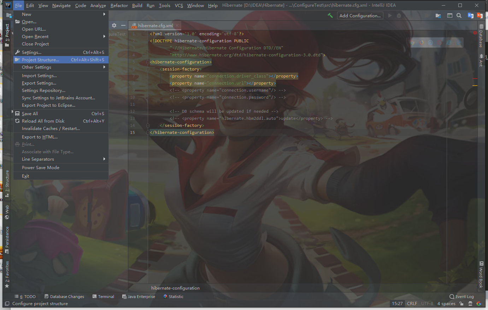

#JAVA Hibernate 在 IDEA 中的环境配置

1. 打开IDEA，进入项目。如果没有项目，则新建项目，无需选择任何选项。  

2. 将Project中和Project同名的module，还有其余文件删除。  
  

3. 新建一个Module，依次点击 File->New->Module...  。  
  

4. Module中选择Hibernate，在下方选择Download。  
  

5. 将Oracle的JDBC导入项目。依次点击File->Project Structure->Modules。  
  
在Project Structure中点击右上角的加号，如图：  
  
添加后结果如下：  
  

6. 至此，基本环境和依赖包基本安装完毕。  