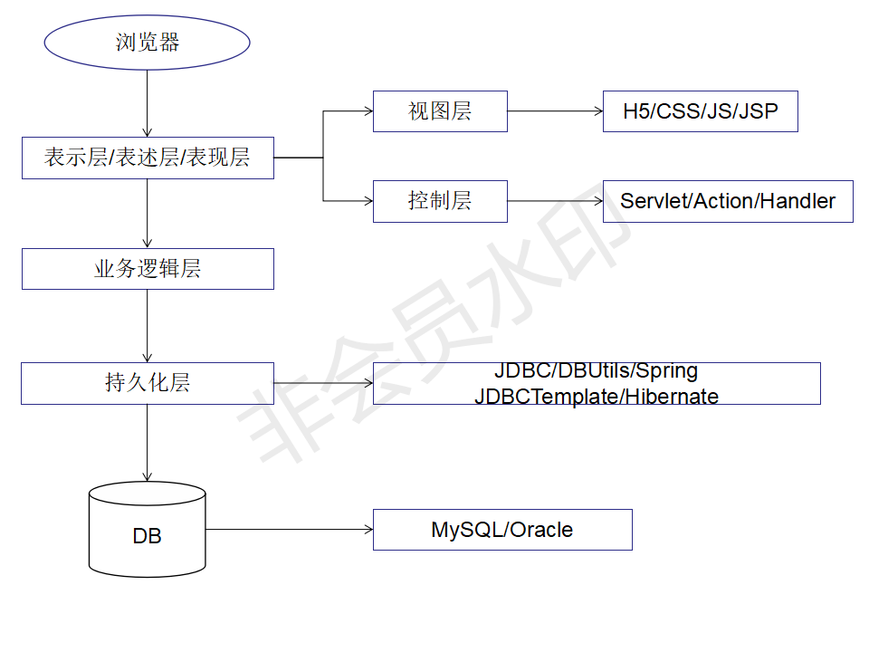
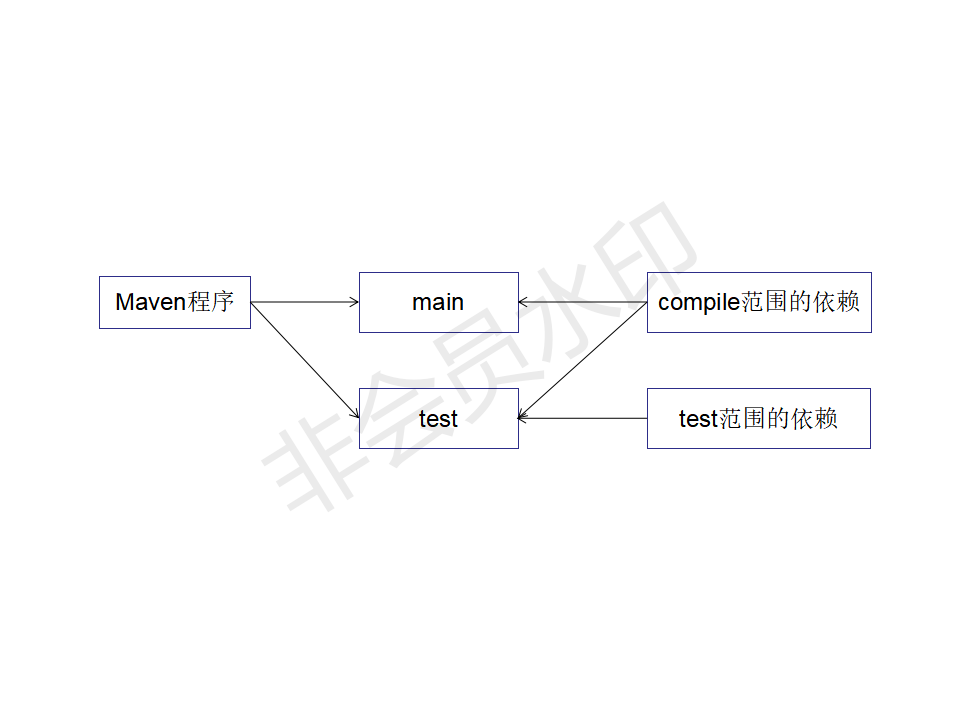
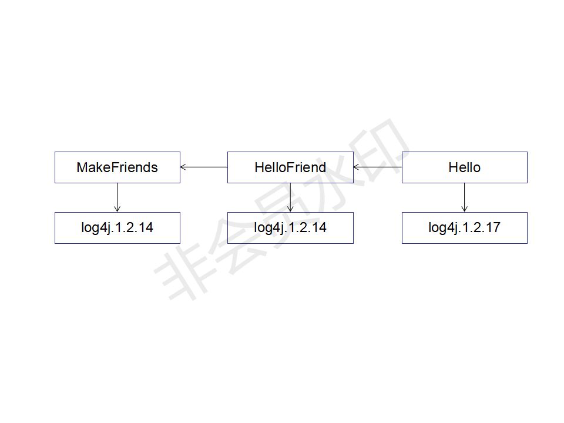

## 自动化构建工具：Maven

1. 目前掌握的技术  



2. 目前的技术在开发中存在的问题  

	1. 一个项目就是一个工程：  
	如果项目非常庞大，就不适合继续使用package来划分模块。最好是每一个模块对应一个工程，利于分工协作。  
	借助于Maven就可以将一个项目拆分成多个工程。  

	2. 项目中需要的JAR包必须手动“复制”、“粘贴”到WEB-INF/lib目录下  
	带来的问题：同样的JAR包文件重复出现在不同的项目工程中，一方面浪费存储空间，另外也让工程比较臃肿  
	借助Maven，可以将jar包仅仅保存在“仓库”中，有需要使用的工程引用这个文件接口，并不需要真的把jar包复制过来。  

	3. jar包需要别人替我们准备好，或到官网下载  
	不同技术的官网提供jar包下载的形式是五花八门的。  
	有些技术的官网就是通过Maven或SVN等专门的工具提供下载的。  
	如果是以不规范的方式下载的jar包，那么其中的内容很可能也是不规范的。  
	借助于Maven可以以一种规范的方式下载jar包。因为所有知名框架或第三方工具的jar包已经按照统一的规范存放在了Maven的中央仓库中。  
	以规范的方式下载的jar包，内容也是可靠的。  
	Tips：“统一的规范” 不仅是对IT开发领域非常重要，对于整个人类社会都是非常重要的。  

	4. 一个jar包依赖的其他jar包需要自己手动加入到项目中  
	FileUpload组件->IO组件。  
	如果所有jar包之间的依赖关系都需要程序员自己非常清楚的了解，那么就极大的增加学习成本。  
	Maven会自动将被依赖jar包导入进来。  

3. Maven是什么  
	1. Maven是一款服务于Java平台的自动化**构建**工具。  
	Make->Ant->Maven->Gradle  
	2. 构建  
		1. 概念：以"Java源文件"、"框架配置文件"、"JSP"、"HTML"、"图片"等资源为"原材料"，去"生产"一个可以运行的项目的过程。  
			* 编译  
			* 部署  
			* 搭建  
		2. 编译：Java源文件[User.java]->编译->Class字节码文件[User.class]->交给JVM去执行  
		3. 部署：一个BS项目最终运行的并不是动态Web工程本身，而是这个动态Web工程“编译的结果”  
	3. 构建过程中的各个环节  
		1. 清理：将以前编译得到的旧的Class字节码文件删除，为下一次编译做准备。  
		2. 编译：将Java源程序编译为Class字节码文件。  
		3. 测试：自动测试，自动调用Junit程序。  
		4. 报告：测试程序执行的结果。  
		5. 打包：动态Web工程打war包，Java工程打Jar包。  
		6. 安装：Maven特定的概念--将打包得到的文件复制到“仓库”中的指定位置。  
		7. 部署：将动态Web工程生成的War包复制到Servlet容器的指定目录下，使其可以运行。  
	4. 自动化构建  

4. 安装Maven核心程序  
	1. 检查JAVA_HOME环境变量。  
	2. 解压Maven程序的压缩包，放在非中文无空格路径下。  
	3. 配置Maven相关的环境变量  
		1. MAVEN_HOME或M2_HOME  
		2. path
	4. 验证：运行mvn -v命令查看Maven版本  

5. Maven的核心概念  
	1. **约定的目录结构**  
		工程名  
		|----src  
		|----|----main  
		|----|----|----java  
		|----|----|----resources  
		|----|----test  
		|----|----|----java  
		|----|----|----resources  
		|----pom.xml  
	2. **POM**
	3. **坐标**  
	4. **依赖**
	5. ***仓库***
	6. 生命周期/插件/目标
	7. 继承  
	8. 聚合

6. 第一个Maven工程  
	1. 创建约定的目录结构  
		1. 根目录：工程名  
		2. src目录：源码  
		3. pom.xml文件：Maven工程的核心配置文件  
		4. main目录：存放主程序  
		5. test目录：存放测试程序  
		6. Java目录：存放Java源文件  
		7. resources目录：存放框架或其他工具的配置文件    
	2. 为什么要遵守约定的目录结构呢？  
		* Maven要负责我们这个项目的自动化构建，以编译为例，Maven想要自动进行编译，那么它必须指导Java源文件保存在哪里。  
		* 如果我们自己自定义的东西想要让框架或工具知道，有两种办法：
			* 以配置的方式明确告诉框架  
			```
				<param-value>classpath:spring-context.xml</param-value>
			```
			* 遵守框架内部已经存在的约定  
			```
				log4j.properties
				log4j.xml
			```
		* 约定>配置>编码
7. 常用Maven命令
	1. 注意：执行与构建过程相关的Maven命令，必须进入pom.xml所在的目录。  
		与构建过程相关：编译、测试、打包、......
	2. 常用命令  
		1. mvn clean：清理
		2. mvn compile：编译主程序  
		3. mvn test-compile：编译测试程序
		4. mvn test：执行测试  
		5. mvn package：打包

8. 关于联网的问题
	1. Maven的核心程序中仅仅定义了抽象的生命周期，但是具体的工作必须由特定的插件来完成。而插件并不包含在Maven的核心程序中。
	2. 当我们执行的Maven命令需要用到某些插件时，Maven核心程序会首先到本地仓库中查找。
	3. 本地仓库的默认位置：[系统中当前用户的家目录]\.m2\repository  
		C:\Users\Passenger\\.m2\repository
	4. Maven核心程序如果在本地仓库中找不到需要的插件，那么它会自动连接外网，到中央仓库去下载  
	5. 如果此时无法连接外网，则构建失败。
	6. 修改默认本地仓库的位置可以让Maven核心程序到我们事先准备好的目录下查找插件  
		1. 找到Maven解压目录\conf\settings.xml  
		2. 在settings.xml中找到localRepository标签  
		3. 将```<localRepository>/path/to/local/repo</localRepository>```中取出  
		4. 将标签体内容修改为已经准备好的Maven仓库目录```<localRepository></localRepository> ```  
	
9. POM
	1. 含义：Project Object Model 项目对象模型  
		DOM：Document Object Model 文档对象模型  
	2. pom.xml对于Maven工程是核心配置文件，与构建过程相关的一切设置都在这个文件中进行配置。  
		重要程度相当于web.xml对于动态Web工程  

10. 坐标
	1. 数学中的坐标：  
		1. 在平面上，使用X、Y两个向量可以唯一的定位平面中的任何一点。  
		2. 在空间中，使用X、Y、Z三个向量可以唯一定位空间中的任何一点。  
	2. Maven的坐标：  
		使用下面三个向量在仓库中唯一定位一个Maven工程  
		1. groupid：公司或组织域名倒序+项目名```<groupid>edu.xju.lt.maven</groupid>```  
		2. artifactid：模块名```<artifactid>Hello</artifactid>```  
		3. version：版本```<version>1.0.0</version>```  
	3. 坐标与仓库中路径的对映关系  
	```
		<groupId>org.springframework</groupId>
		<artifactId>spring-core</artifactId>
		<version>4.0.0.RELEASE</version>
	```
	```org/springframework/spring-core/4.0.0.RELEASE/spring-core-4.0.0.RELEASE.jar```  

11. 仓库
	1. 仓库的分类  
		1. 本地仓库：当前电脑上部署的仓库目录，为当前电脑上所有Maven工程服务  
		2. 远程仓库  
			1. 私服：搭建在局域网环境中，为局域网范围内的所有Maven工程服务  
			2. 中央仓库：架设在Internet上，为全世界所有Maven工程服务  
			3. 中央仓库镜像：为了分担中央仓库的流量，提升用户访问速度  
	2. 仓库中保存的内容：Maven工程  
		1. Maven自身所需要的插件  
		2. 第三方框架或工具的jar包
		3. 我们自己开发的Maven工程

12. 依赖
	1. Maven解析依赖信息时会到本地仓库中寻找被依赖的Jar包。  
		对于我们自己开发的Maven工程，使用install命令就可以进入仓库。  
	2. 依赖的范围  
		  
		1. compile范围依赖  
			* 对主程序是否有效：有效  
			* 对测试程序是否有效：有效  
			* 是否参与打包：参与  
		2. test范围依赖  
			* 对主程序是否有效：无效  
			* 对测试程序是否有效：有效  
			* 是否参与打包：不参与  
		3. provided范围依赖  
			* 对主程序是否有效：有效  
			* 对测试程序是否有效：有效  
			* 是否参与打包：不参与  
			* 是否参与部署：不参与  
			* 典型例子：servlet-api.jar  
			  

13. 生命周期  
```java
		maven-resources-plugin:3.0.2:resources
		maven-compiler-plugin:3.8.0:compile
		maven-resources-plugin:3.0.2:testResources
		maven-compiler-plugin:3.8.0:testCompile
		maven-surefire-plugin:2.22.1:test
		测试报告
		maven-jar-plugin:2.4:jar//package
		maven-install-plugin:2.5.2:install
```
	1. 各个构建环节执行的顺序：不能打乱顺序，必须按照既定的正确顺序来执行。  
	2. Maven的核心程序中定义了抽象的生命周期，生命周期中各个阶段的具体任务是由插件来完成。  
	3. Maven核心程序为了更好的实现自动化构建，按照这一特点执行生命周期的各个阶段：不论现在要执行生命周期中的哪一个阶段，都是从这个生命周期最初的位置执行。  
	4. 插件和目标  
		1. 生命周期的各个阶段仅仅定义了要执行的任务是什么。  
		2. 各个阶段和插件的目标是对应的。  
		3. 相似的目标由特定的插件来完成。  
		4. 可以将目标看作“调用插件功能的命令”  

|  生命周期阶段  |  插件目标  |  插件  |
|  ----  |  ---- |  ---- |
|  compile  |  compile  |  maven-compiler-plugin  |
|  test-compile  |  testCompile  |  maven-compiler-plugin  |

14. 依赖[高级]  
    1. 依赖的传递性  
    	1. 好处：可以传递的依赖不必在每个模块工程中都重复声明，在“最下面”工程中依赖一次即可。  
    	2. 注意：非compile范围的依赖不能传递。所以在各个工程模块中，如果有需要就得重复声明依赖。  
    	
    2. 依赖的排除  	
    	1. 如果有不稳定的jar包需要进行排除  
    	
    	2. 依赖排除的设置方式  
    	    在```<dependency></dependency>```中写入  
    	
    	  ```xml
        <exclusions>
    	  	<exclusion>
    	  		<groupId></groupId>
    	  		<artifactId></artifactId>
    	  	</exclusion>
    	  <exclusions>
    	  ```
    	
    	即可  
    	Tips：排除的也会依赖，即被排除的依赖，在继承的里面也会被排除。  
    	
    3. 依赖的原则

       1. 依赖的原则  

          1. 作用：解决模块工程之间的jar包冲突问题  

          2. 验证路径最短优先原则  
             		  

          3. 验证路径相同时，先声明者优先(先声明指的是dependency标签的声明顺序)  

          4. 统一管理依赖的版本  

             1. 要对各种包进行升级

                1. 使用properties标签内使用自定义标签统一声明版本号  

                   ```xml
                   <properties>
                   	<标签名></标签名>
                   </properties>
                   ```

                   

                2. 在需要统一版本的位置，使用${自定义标签名}引用声明的版本号```<version>${标签名}</version>```  