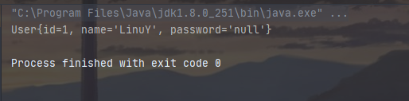

# MyBatis  

## 1. 简介  


### 1.1 什么是MyBatis  

* MyBatis 是一款优秀的**持久层框架**  

* 它支持自定义 SQL、存储过程以及高级映射

* MyBatis 免除了几乎所有的 JDBC 代码以及设置参数和获取结果集的工作

* MyBatis 可以通过简单的 XML 或注解来配置和映射原始类型、接口和 Java POJO（Plain Old Java Objects，普通老式 Java 对象）为数据库中的记录  

* MyBatis本是apache的一个开源项目iBatis，2010年这个项目由apache software foundation迁移到了google code，并且改名为MyBatis  

* 2013年迁移到Github  

    获得MyBatis：

    ```xml
    <dependency>
        <groupId>org.mybatis</groupId>
        <artifactId>mybatis</artifactId>
        <version>3.4.6</version>
    </dependency>
    ```

      

### 1.2 持久化  

数据持久化   

	* 持久化就是将程序的数据在持久状态和瞬时状态转化的过程  
	* 内存：**断电即失**  
	* 数据库(jdbc)，io文件持久化
	* 生活：冷藏

为什么需要持久化？**

* 有一些对象，不能让他丢掉。
* 内存太贵了


### 1.3 持久层

Dao层，Service层，Controller层...

	* 完成持久化工作的代码块
	* 层界限十分明显


### 1.4 为什么需要MyBatis？

	* 帮助程序员将数据存入到数据库中

 * 方便

 * 传统的JDBC代码太复杂了。 简化 框架 自动化

 * 不用MyBatis也可以。更容易上手

 * 优点：

    	* 简单易学
        	* 灵活
            	* sql和代码的分离，提高了可维护性
                	* 提供映射标签，支持对象与数据库的orm字段关系映射
                    	* 提供对象关系映射标签，支持对象关系组件维护
                        	* 提供xml标签，支持写动态sql

    **最重要的一点：使用的人多！**

    Spring  SpringMVC  SpringBoot
    
    

## 2. 第一个MyBatis程序

​	思路：搭建环境-->导入MyBatis-->编写代码-->测试！


### 2.1 搭建环境

 1. 搭建数据库

    ```sql
    CREATE DATABASE demo;
    USE demo;
    CREATE TABLE USER (
    	id INT(20) NOT NULL PRIMARY KEY,
    	NAME VARCHAR(30) DEFAULT NULL,
    	pwd VARCHAR(30) DEFAULT NULL
    ) ENGINE=INNODB DEFAULT CHARSET=utf8;
    
    INSERT INTO 
    USER(id, NAME,pwd) 
    VALUES
    (1, 'LinuY', '123456'),
    (2, 'Zhang San', '123456'),
    (3, 'Li Si', '123456');
    ```

2. 新建项目

    1. 新建一个普通的maven项目

    2. 删除src目录

    3. 导入maven依赖

        ```xml
        <?xml version="1.0" encoding="UTF-8"?>
        <project xmlns="http://maven.apache.org/POM/4.0.0"
                 xmlns:xsi="http://www.w3.org/2001/XMLSchema-instance"
                 xsi:schemaLocation="http://maven.apache.org/POM/4.0.0 http://maven.apache.org/xsd/maven-4.0.0.xsd">
            <modelVersion>4.0.0</modelVersion>
        
            <groupId>stu.lt</groupId>
            <artifactId>MyBatis-parent</artifactId>
            <version>1.0-SNAPSHOT</version>
            <packaging>pom</packaging>
        
            <dependencies>
                <!-- myBatis -->
                <dependency>
                    <groupId>org.mybatis</groupId>
                    <artifactId>mybatis</artifactId>
                    <version>3.4.6</version>
                </dependency>
                <!-- MySql驱动 -->
                <dependency>
                    <groupId>mysql</groupId>
                    <artifactId>mysql-connector-java</artifactId>
                    <version>8.0.11</version>
                </dependency>
            </dependencies>
        </project>
        ```


### 2.2 创建一个模块

- 编写MyBatis的核心配置文件

    ```xml
    <?xml version="1.0" encoding="UTF-8" ?>
    <!DOCTYPE configuration
            PUBLIC "-//mybatis.org//DTD Config 3.0//EN"
            "http://mybatis.org/dtd/mybatis-3-config.dtd">
    <!-- configuration核心配置文件 -->
    <configuration>
    
        <environments default="development">
            <environment id="development">
                <transactionManager type="JDBC"/>
                <dataSource type="POOLED">
                    <property name="driver" value="com.mysql.cj.jdbc.Driver"/>
                    <property name="url" value="jdbc:mysql://localhost:3306/demo?characterEncoding=utf8&amp;useSSL=false&amp;serverTimezone=UTC&amp;rewriteBatchedStatements=true"/>
                    <property name="username" value="root"/>
                    <property name="password" value="han143650"/>
                </dataSource>
            </environment>
        </environments>
    
    </configuration>
    ```

- 编写MyBatis工具类

    ```java
    public class MyBatisUtils {
    
        private static SqlSessionFactory sqlSessionFactory;
    
        static {
            try {
                String resource = "mybatis-config.xml";
                InputStream inputStream = Resources.getResourceAsStream(resource);
                sqlSessionFactory = new SqlSessionFactoryBuilder().build(inputStream);
            } catch (IOException e) {
                e.printStackTrace();
            }
        }
    
        public static SqlSession getSqlSession() {
            return sqlSessionF
                actory.openSession();
        }
    }
    ```
    

### 2.3 编写代码

- 实体类

    ```java
    public class UserEntity {
        private int id;
        private String name;
        private String pwd;

        @Override
        public String toString() {
            return "UserEntity{" +
                    "id=" + id +
                    ", name='" + name + '\'' +
                    ", pwd='" + pwd + '\'' +
                    '}';
        }

        public UserEntity() {
        }

        public UserEntity(int id, String name, String pwd) {
            this.id = id;
            this.name = name;
            this.pwd = pwd;
        }

        public int getId() {
            return id;
        }

        public void setId(int id) {
            this.id = id;
        }

        public String getName() {
            return name;
        }

        public void setName(String name) {
            this.name = name;
        }

        public String getPwd() {
            return pwd;
        }

        public void setPwd(String pwd) {
            this.pwd = pwd;
        }
    }

    ```


- Mapper接口

    ```java
    public interface UserMapper {

        /**
         * 查询所有用户
         * @return List<UserEntity>
         */
        public List<UserEntity> getUserList();

    }
    ```


- 接口实现类：由原来的UserMapperImpl转变为一个Mapper配置文件。  

    ```xml
    <?xml version="1.0" encoding="UTF-8" ?>
    <!DOCTYPE mapper
            PUBLIC "-//mybatis.org//DTD Mapper 3.0//EN"
            "http://mybatis.org/dtd/mybatis-3-mapper.dtd">
    <!-- namespace绑定一个对应的Dao/Mapper接口 -->
    <mapper namespace="stu.lt.demo.mapper.UserMapper">

        <!-- select查询语句
            id : 方法名
            resultType : 返回结果类型
            resultMap : 返回结果集
         -->
        <select id="getUserList" resultType="stu.lt.demo.entity.UserEntity">
            select * form user
        </select>

    </mapper>
    ```


### 2.4 测试

​	junit测试：  

```java
@Test
public void test() {
    //第一步：获得SqlSession对象
    SqlSession sqlSession = MyBatisUtils.getSqlSession();
    //执行SQL
	UserMapper userMapper = sqlSession.getMapper(UserMapper.class);
    List<UserEntity> userEntities = userMapper.getUserList();

    for (UserEntity userEntity : userEntities) {
        System.out.println(userEntity);
    }

    //关闭SqlSession
    sqlSession.close();
}
```


​	注意点：

```java
org.apache.ibatis.binding.BindingException: Type interface stu.lt.demo.mapper.UserMapper is not known to the MapperRegistry.
```

​	解决方法：

​		    在mybatis-config.xml下加入mapper标签，将其注册。


## 3. CRUD

### 3.1 Namespace

​	namespace中的包名要和Dao/Mapper接口中的一致！


### 3.2 Select

​	选择，查询语句；

* id : 就是对应的namespace中的方法名
* resultType : SQL语句执行的返回值
* parameterType : 参数类型


1. 编写接口

    ```java
    User getUserById(int id);
    ```

2. 编写对应的mapper中的sql语句

    ```xml
    <select id="getUserById" parameterType="int" resultType="stu.lt.demo.entity.User">
            select * from USER where id = #{id}
    	</select>
    ```

### 3.3 Insert

```xml
<insert id="addUser" parameterType="stu.lt.demo.entity.User">
        insert into user(id, name, pwd) value(#{id}, #{name}, #{pwd});
    </insert>
```

### 3.4 Update

```xml
<update id="updateUser" parameterType="stu.lt.demo.entity.User">
        update user set name = #{name},pwd = #{pwd} where id = #{id}
    </update>
```

### 3.5 Delete

```xml
<delete id="deleteUser" parameterType="int">
        delete from USER where id = #{id};
    </delete>
```

注意点：

* 增删改需要提交事务！

### 3.6 分析错误

- 标签不要匹配错了
- resource绑定mapper，需要使用路径
- 程序配置文件必须符合规范
- NullPointException，没有注册到资源
- 输出的xml文件中存在中文乱码问题
- maven资源没有导出问题

### 3.7 万能Map

​	假设，我们的实体类，或者数据库中的表、字段或者参数过多，我们应当考虑使用Map。

```java
int addUser(Map<String, Object> map);
```

```xml
<update id="updateUser" parameterType="stu.lt.demo.entity.User">
        update user set name = #{name},pwd = #{pwd} where id = #{id}
    </update>
```

```java
@Test
public void addUserByMap() {
    SqlSession sqlSession = MyBatisUtils.getSqlSession();

    UserMapper mapper = sqlSession.getMapper(UserMapper.class);
    HashMap<String, Object> stringObjectHashMap = new HashMap<>();
    stringObjectHashMap.put("userId", 5);
    stringObjectHashMap.put("userName", "Zhao Liu");
    stringObjectHashMap.put("userPwd", "123456");
    mapper.addUser(stringObjectHashMap);

    sqlSession.close();
}
```


Map传递参数，直接在sql中取出key即可

对象传递参数，直接在sql中取对象的属性即可

只有一个基本类型参数的情况下，可以直接在sql中取到


### 3.8 思考题

模糊查询怎么查？

1. java代码执行的时候，传递通配符% %

    ```xml
    <select id="getUserLike" resultType="stu.lt.demo.entity.User">
        select * from user where name like '%'#{value}'%';
    </select>
    ```

2. 在sql拼接中使用通配符

    ```java
    public void getUserLike() {
        SqlSession sqlSession = MyBatisUtils.getSqlSession();
    
        UserMapper mapper = sqlSession.getMapper(UserMapper.class);
        List<User> users = mapper.getUserLike("%Li%");
    
        for (User user : users) {
            System.out.println(user);
        }
    
        sqlSession.close();
    }
    ```


## 4. 配置解析

### 4.1 核心配置文件

 * mybatis-config.xml

 * MyBatis配置文件包含了会深深影响MyBatis行为的设置和属性信息

   ```
    properties（属性）
    settings（设置）
    typeAliases（类型别名）
    typeHandlers（类型处理器）
    objectFactory（对象工厂）
    plugins（插件）
    environments（环境配置）
    	environment（环境变量）
    		transactionManager（事务管理器）
    		dataSource（数据源）
    databaseIdProvider（数据库厂商标识）
    mappers（映射器）
   ```


### 4.2 环境变量

​	MyBatis可以配置成适应多种环境

​	**不过要记住：尽管可以配置多个环境，但每个SqlSessionFactory实例只能选择一种环境。**

​	学会使用配置多套运行环境

​	MyBatis默认的事务管理器就是JDBC，连接池：POOLED

### 4.3 属性（properties）

​	我们可以通过properties属性来实现引用配置文件

​	这些属性都是可外部配置且可动态替换的，既可以在典型的java属性文件中配置，亦可通过properties元素的子元素来传递。【db.properties】

​	编写一个配置文件

​	db.properties

```properties
driver=com.mysql.cj.jdbc.Driver
url=jdbc:mysql://localhost:3306/demo?characterEncoding=utf8&useSSL=false&serverTimezone=UTC&rewriteBatchedStatements=true
username=root
password=han143650
```

​	在核心配置文件中引入

```xml
<!-- 引入外部配置文件 -->
<properties resource="./META-INF/spring/db.properties">
    <property name="username" value="root"/>
</properties>
```

	* 可以直接引入外部文件
	* 可以在其中增加一些属性配置
	* 如果两个文件有同一个字段，优先使用外部配置文件的

### 4.4 类型别名（typeAliases）

 * 类型别名是为了Java类型设置一个短的名字

 * 存在的意义仅在于用来减少类完全限定名的冗余

    ```xml
    <!-- 可以给实体类起别名 -->
    <typeAliases>
        <typeAlias type="stu.lt.demo1.entity.User" alias="User"/>
    </typeAliases>
    ```

    也可以指定一个包名，MyBatis会在包名下面搜索需要的java Bean

    扫描实体类的包，它的默认别名就为这个类的类名，首字母小写

    ```xml
    <typeAliases>
        <package name="stu.lt.demo1.entity"/>
    </typeAliases>
    ```

    在实体类比较少的时候，使用第一种方式

    如果实体类十分少，建议使用第二种\+

    第一种可以DIY别名，第二种不行，如果非要改，需要在实体类上增加注解

    ```java
    @Alias("user")
    public class User
    ```

    

### 4.5 设置

​	这是 MyBatis 中极为重要的调整设置，它们会改变 MyBatis 的运行时行为。

### 4.6 其他配置

 * plugins插件
    	* mybatis-generator-core
        	* mybatis-plus
            	* 通用mapper

### 4.7 映射器（mappers）

​	MapperRegistry：注册绑定我们的Mapper文件：

1. 方式一：

```xml
<mappers>
        <mapper resource="./mapper/UserMapper.xml"/>
    </mappers>
```

2. 方式二：使用class文件绑定注册

```xml
<mappers>
        <mapper class="stu.lt.demo1.mapper.UserMapper"/>
    </mappers>
```

​	注意点：

	* 接口和他的Mapper配置文件必须同名
	* 接口和他的Mapper配置文件必须在同一个文件夹下

3. 方式三：使用扫描包进行注入绑定

    ```xml
    <mappers>
            <package name="stu.lt.demo1.mapper"/>
        </mappers>
    ```

    注意点同上！

### 4.8 生命周期

​	生命周期和作用域是至关重要的，因为错误的使用会导致非常严重的并发问题

1. SqlSessionFactoryBuilder：

    * 一旦创建了SqlSessionFactory，就不再需要它了
    * 局部变量

2. SqlSessionFactory：

    * 说白了就是可以想象成：数据库连接池

    * 一旦创建就应该在应用运行期间一直存在，**没有任何理由丢弃它或者重新创建另一个实例**
    * 因此SqlSessionFactory最佳的作用域就是应用作用域
    * 最简单的就是使用单例模式或者静态单例模式

3. SqlSession

    * 连接到连接池的一个请求
    * SqlSession实例不是线程安全的，因此是不能被共享的，所以它的最佳的作用域是请求或方法作用域
    * 用完之后需要赶紧关闭，否则资源被占用


​	这里面的每一个Mapper，就代表一个具体的业务


## 5. 解决属性名和字段名不一致的问题

### 5.1 问题

​	数据库中的字段


​	新建一个项目，拷贝之前的，测试实体类字段不一致的情况

```java
public class User {

    private int id;
    private String name;
    private String password;
}
```

​	测试出现问题：



```sql
select * from user where id = #{id};
//类型处理器
select id,name,pwd from user where id = #{id};
```

### 5.2 解决方案

 1. 起别名

    ```xml
    <select id="getUserById" resultType="User" parameterType="_int">
        select id,name,pwd as password from user where id = #{id};
    </select>
    ```

2. resultMap

    结果集映射

| id   | name | pwd      |
| ---- | ---- | -------- |
| id   | name | password |

```xml
<select id="getUserById" resultMap="UserMap">
    select * from user where id = #{id};
</select>

<!-- 结果型映射 -->
<resultMap id="UserMap" type="User">
    <!-- column数据库中的字段，properties实体类中的属性 -->
    <result column="id" property="id"/>
    <result column="name" property="name"/>
    <result column="pwd" property="password"/>
</resultMap>
```

* resultMap元素是MyBatis中最重要最强大的元素
* resultMap的设计思想是，对于简单的语句根本不需要配置现实的结果映射，而对于复杂一点的语句只需要简单描述它们的关系就行了
* resultMap最优秀的地方在于，即使你已经对它相当了解了，但是根本就不需要显式地用到他们


